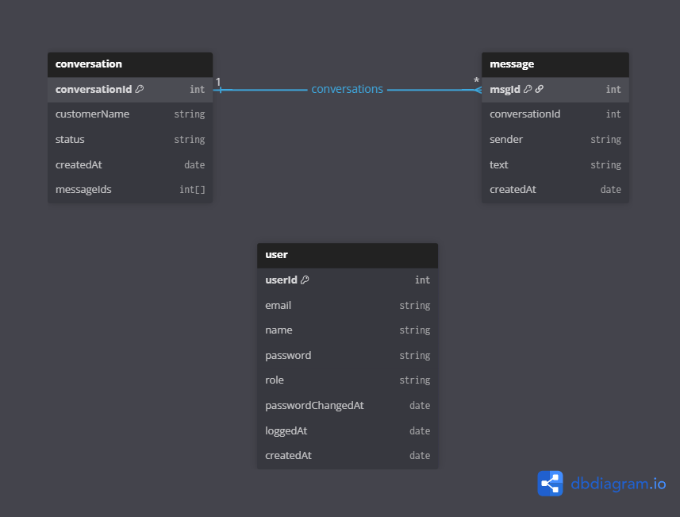
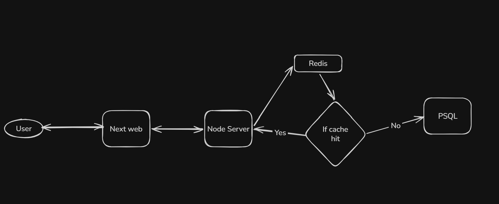

## Stacks
- Backend: Node.js, Express, TypeORM,  OpenAI API, BullMQ
- Frontend: Next.js, Tailwind CSS, Shadcn UI
- Database: PostgreSQL, Redis

## Entity Diagram

## Normal Flow

## AI Suggestion Flow
